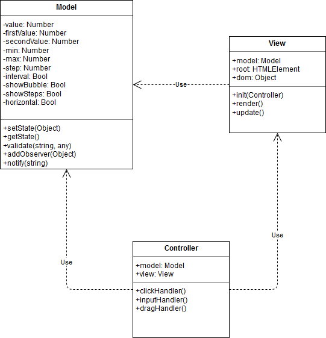

# Slider plugin

## Usage

### Initializing

```js
//initPlugin(<selector>, {<options>});
//returns {model, view, controller} object

//default
initPlugin('#slider');

//custom options
initPlugin('#slider', {
    max: 20,
    step: 5
});

//throws an error
initPlugin('does-not-exist');
```

Default options(can be overriden during initialization or changed with `model.set` method after object has been created):

```js
const def = {
    value: 0,
    min: 0,
    max: 100,
    step: 1,
    showBubble: true,
    showSteps: false,
    horizontal: true
}
```

### Getting/setting model values

You can only set values from the options above:

```js
const slider = initPlugin('#slider');

slider.model.set('value', 10);
let value = slider.model.get('value');

//displays error in console
let invalid = slider.model.get('nothing');

//also displays an error due to the model's validation/type checking
let notNum = slider.model.set('value', 'NaN');
```

### Updating slider value

```js
const slider = initPlugin('#slider', {
    max: 20,
    step: 5
});

//set value
slider.model.set('value', 10);

//notify view, call view.update method
slider.model.notifyAll();
```

Note that this method(`view.update`) only changes the value of the slider(its handle position). Other DOM manipulations such as adding classes or creating and appending elements can get complicated, so it's easier to just re-render the whole thing than to check for certain changes.

### Re-rendering

```js
//view.render method is called implicitly
const slider = initPlugin('#slider');

//you can also use an object to set values
slider.model.set({
    value: 10,
    max: 20,
    step: 5
});

//re-render the view using new model state
slider.view.render();
```

## Architecture

### UML



### Model

The main concern of the model is to store values which represent slider's state. It also has some validation logic. For instance, if you try setting `max` to a string, the action will fail. You'll get an error message in console instead. 

Here are the value constraints:

* `value`, `min`, `max` and `step` should be numbers.
* `showBubble`, `showStep` and `horizontal` should be booleans.
* `value` should be a positive number lying between zero and `min`-`max` difference. If it goes out of bounds, it'll be rounded to zero or `max`. Otherwise it is rounded to the nearest value divisible by `step`.
* `min` should be less than `max`.
* `max` should be more than `min`.
* `step` should be positive, `min` and `max` difference should be divisible by it.

Model also has methods for adding and notifying observers(views). `addObserver` simply adds an object reference to an array, `notifyAll` calls each view's `update` method. Although here there is no need to have multiple views, this can still come in handy for some new features.

### View

View's sole responsibility is DOM manipulation. It has two methods - `render` and `update`. The constructor has one parameter - model. Upon object creation, view:

* Tries to set its root element with the model's selector(throws error on failure).
* Adds itself to the model's observers.

After intitialization `render` method should be called with a controller as an argument. It will create `dom` object conforming to the model and append it to the root element. Browser events are also set here, but the actual handlers belong to the controller, hence the controller argument.

`update` method is used to synchronize model's value and the actual slider value/its handle position.

### Controller

Controller is used to implement event handling logic. Its constructor has two parameters - model and view. It calls view's `render` method, providing reference to controller as an argument. `render` adds browser events to controller's handlers, which include:

* `clickHandler` is bound to the slider's status bar. It calculates value relative to the bar's width, calls model's `set` and `notifyAll` methods(all handlers do this, since the model's `value` is updated).
* `inputHandler` takes input element value on blur event, sets it and notifies view.
* `dragHandler` is called on mousedown event on the slider's handle. While mouse key is pressed, it updates the slider's and model's values accordingly.